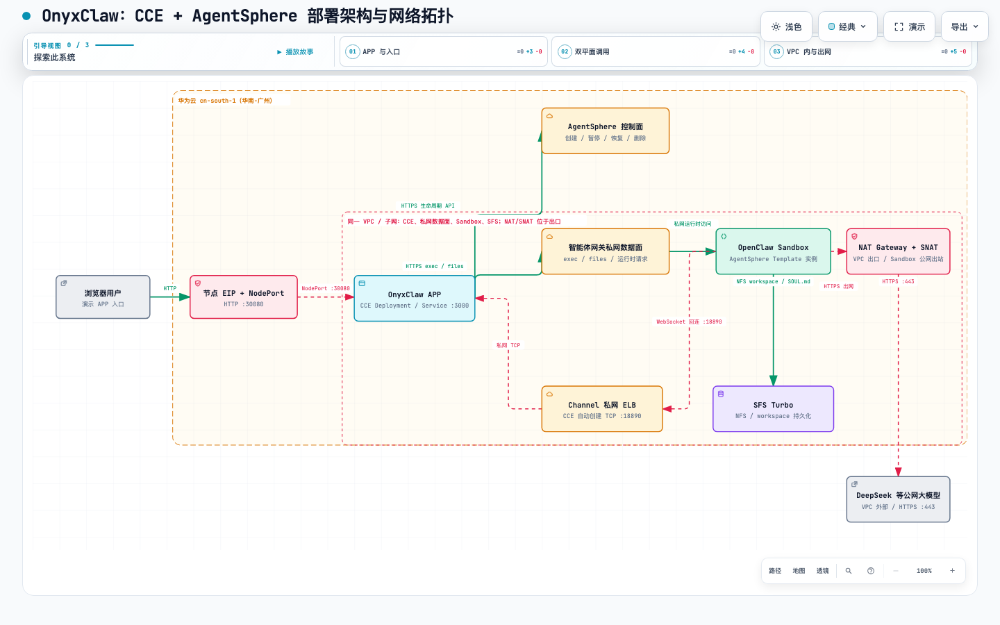

# OnyxClaw：CCE + AgentSphere 从零部署包

本包把 OnyxClaw Cloud APP 部署到华为云 CCE，并让 APP 借助 AgentSphere 创建、管理 OpenClaw Sandbox。
它覆盖从空账号资源准备到浏览器端端到端验收的完整闭环；当前固定支持华南-广州 `cn-south-1`。

完整验收链路是：创建 Sandbox → 写入并持久化 `SOUL.md` → Channel 回连 → DeepSeek 模型对话 →
pause/resume → reset/kill 清理。

## 总体架构与网络拓扑



拓扑的关键约束如下：

- CCE、智能体网关、Template/Sandbox 与 SFS Turbo 必须在同一 VPC；网关必须开启私网访问。
- APP 对 AgentSphere 的调用分为两条并行链路：**控制面**只处理 Sandbox 的创建、暂停、恢复与删除；
  **私网数据面**处理 `exec`、文件读写等运行时请求。
- APP 页面使用 NodePort `30080`；Channel 由 CCE 自动创建私网 ELB，监听 `18890/TCP`，Sandbox 通过 WebSocket 回连。
- Sandbox 访问 DeepSeek 等公网模型只能走其所在子网的 NAT Gateway + SNAT；节点公网 EIP 不能代替 SNAT EIP。
- SFS Turbo 挂载固定 workspace，保存 `SOUL.md` 等状态；AgentSphere 提供 pause/resume 能力。

## 选择部署路径

三条路径最终都使用同一个 `config/`、`scripts/` 和验收流程。不同之处仅在云资源由谁创建。

| 你的条件 | 推荐路径 | AI Agent 负责 | 人工必须完成 |
| --- | --- | --- | --- |
| 有华为云 AK/SK，且可使用 AI Agent | **最快自动化路径** | 按 Terraform 创建独立 VPC/子网、CCE、节点/EIP、NAT/SNAT 与 SFS；预检、准备 SFS、部署 APP、收集验收证据。 | 在本地安全提供 AK/SK、节点登录方式并审阅 Terraform plan；从 CCE 下载 kubeconfig；在 AgentSphere 控制台创建私网网关和 Template；填写 4 项环境信息与 2 个 API Key。 |
| 没有 AK/SK，但可使用 AI Agent | **半自动路径** | 根据本包手册检查人工创建的资源，执行 kubeconfig/RBAC 预检、SFS 准备、APP 部署、运行时 DNS 检查与验收辅助。 | 在华为云控制台创建 VPC、CCE、NAT/SNAT、SFS；下载 kubeconfig；创建私网网关和 Template；填写本地配置与密钥。 |
| 没有 AK/SK，也没有 AI Agent | **人工路径** | 不适用。 | 按控制台手册创建云资源，按部署手册执行脚本、打开 APP，并完成全部验收。 |

AI Agent 可以是 Codex 或其他能读取仓库文件、运行 Terraform / Node.js / kubectl 的 Agent。所有 Agent 都应先阅读
[AGENTS.md](./AGENTS.md) 和 [Agent 部署 Runbook](./docs/AGENT_DEPLOYMENT.md)。AK/SK、kubeconfig、节点密码和
API Key 只能保存在本地受保护文件或凭据环境中，不能提交、粘贴进聊天或写入 Terraform plan。

## 从零到端到端验收的闭环

无论选择哪条路径，都按下列阶段推进。每一阶段的输出就是下一阶段的输入。

| 阶段 | 完成动作 | 继续条件 / 输出 |
| --- | --- | --- |
| 1. 选择路径与权限 | 选择上表路径；确认账号已开通 CCE、SFS Turbo、AgentSphere，且 Region 为 `cn-south-1`。 | 快速路径还需本地可用 AK/SK；其余路径按控制台权限执行。 |
| 2. 创建基础设施 | 通过 Terraform 或控制台创建同一 VPC/子网中的 CCE、工作节点、NAT/SNAT 和 SFS Turbo。 | 节点为 Ready；Sandbox 子网可经 SNAT HTTPS 出网；取得 SFS ID 与 NFS 根路径。 |
| 3. 完成人工控制台边界 | 从 CCE 下载 kubeconfig；在 AgentSphere 创建开启私网访问的网关；在同 VPC 创建 Template。 | 得到 kubeconfig、网关私网数据面 URL、Template ID。Template 的“选择镜像”直接填写固定公开 OpenClaw tag。 |
| 4. 填写本地输入 | 运行 `./scripts/init.sh`。 | `config/config.env` 填 4 项；`config/secrets.env` 填 2 个 API Key。 |
| 5. 准备与部署 | 初始化 SFS workspace；执行离线检查、集群预检、server dry-run 和正式部署。 | `SFS_PREPARE_OK`；APP Pod Ready；控制面和网关私网数据面 DNS 均可解析。 |
| 6. 页面端到端验收 | 浏览器打开 APP，点击“进入龙虾模式”，进行对话、pause/resume 与 reset。 | Sandbox 创建、Channel 回连、模型回复、SFS 持久化与清理均有证据。 |
| 7. 清理或保留 | 先在 APP reset Sandbox；再明确选择保留或按资源 ID 释放云资源。 | 不批量删除；Terraform 创建的资源先审阅 destroy plan。 |

### 路径 A：最快自动化（AK/SK + AI Agent）

1. 让 Agent 阅读 [AGENTS.md](./AGENTS.md)、[Terraform 模块](./iac/cce/README.md) 和
   [Agent 部署 Runbook](./docs/AGENT_DEPLOYMENT.md)。
2. 在本地受保护的 `iac/cce/secrets.auto.tfvars` 或受控环境变量中提供 AK/SK，并配置节点密钥对或节点密码；
   生成后人工审阅 `terraform plan`，再明确授权 Agent 执行 `apply`。
3. Agent 完成基础设施创建后，人工从 CCE 下载 kubeconfig，并在 AgentSphere 控制台完成网关和 Template。
4. 人工填写最小配置，Agent 继续执行阶段 5–6；Agent 不得自行扩大 IAM、网络暴露或模拟 AgentSphere 控制台操作。

### 路径 B：半自动（无 AK/SK + AI Agent）

1. 人工完整阅读 [云资源前置条件](./docs/CLOUD_PREREQUISITES.md)，在控制台完成阶段 2–3。
2. 将 kubeconfig 的本地绝对路径、网关私网数据面 URL、Template ID、SFS ID 和两个 API Key 填入本地 `config/`。
3. 让 Agent 执行 [Agent 部署 Runbook](./docs/AGENT_DEPLOYMENT.md) 中的只读预检、SFS 准备、部署与验收取证。

### 路径 C：人工部署（无 AK/SK + 无 AI Agent）

1. 依次执行 [云资源前置条件](./docs/CLOUD_PREREQUISITES.md) 与 [人工部署与使用](./docs/HUMAN_DEPLOYMENT.md)。
2. 脚本的唯一写入口是 `scripts/deploy.mjs` / `scripts/deploy.sh`；不要另建平行 Kubernetes Manifest。
3. 按阶段 6 的标准在页面完成全部功能验收。

## 最小本地配置与部署命令

所有路径共用同一份最小配置：

```bash
./scripts/init.sh
# 编辑 config/config.env：KUBECONFIG、网关私网 URL、Template ID、SFS Turbo ID
# 编辑 config/secrets.env：AgentSphere E2B API Key、DeepSeek API Key

# SFS 已创建后，使用控制台提供的 NFS 共享根路径初始化 workspace
./scripts/prepare-sfs.sh \
  --kubeconfig /absolute/path/to/cce-kubeconfig.yaml \
  --nfs-endpoint 192.168.x.x:/

# 离线检查 → 集群预检 → 首次部署前的 API Server 校验 → 正式部署
node scripts/deploy.mjs --config config/config.env --secrets config/secrets.env --dry-run
./scripts/deploy.sh --check-cluster
./scripts/deploy.sh --server-dry-run
./scripts/deploy.sh
```

默认使用 kubeconfig 的 `current-context`，只有一个文件含多个集群时才在 `config/config.env` 增加可选
`KUBE_CONTEXT`。首次 `--server-dry-run` 会创建默认 namespace `onyxclaw`，但不会持久化其他对象。

## 文档与目录导航

| 需要了解的内容 | 入口 |
| --- | --- |
| 云资源创建顺序、控制台填写项、官方文档链接 | [云资源前置条件](./docs/CLOUD_PREREQUISITES.md) |
| Terraform 创建 VPC、CCE、NAT/SNAT、SFS | [Terraform 基础设施与 CCE](./iac/cce/README.md) |
| 人工部署命令、页面使用与完整验收 | [人工部署与使用](./docs/HUMAN_DEPLOYMENT.md) |
| 供任意 AI Agent 执行的安全边界、证据和停止条件 | [Agent 部署 Runbook](./docs/AGENT_DEPLOYMENT.md) |
| 当前稳定镜像和关键运行时约束 | [稳定基线](./docs/references/CURRENT_DEMO_BASELINE.md) |
| 空账号实际验证的经验与故障案例 | [空账号自测记录](./docs/references/NEW_ACCOUNT_VALIDATION.md) |

| 目录 | 职责 |
| --- | --- |
| `iac/cce/` | 可选 Terraform 基础设施模块；不管理 AgentSphere 网关/Template 或 APP 配置。 |
| `config/` | 可提交的示例与本地生成的敏感配置；真实文件不会提交。 |
| `scripts/` | 唯一的 SFS 准备和 Kubernetes 部署入口。 |
| `docs/` | 面向人工部署者和 AI Agent 的分路径手册。 |
| `docs/references/` | 已验证基线与空账号实测记录，只用于对照。 |
| `assets/` | 架构图与 AgentSphere 控制台示意图。 |
