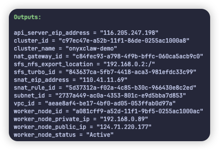
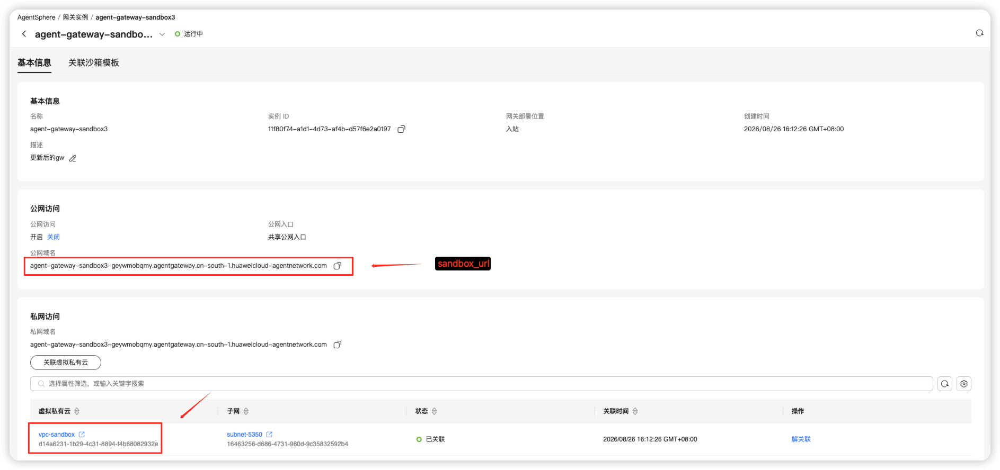
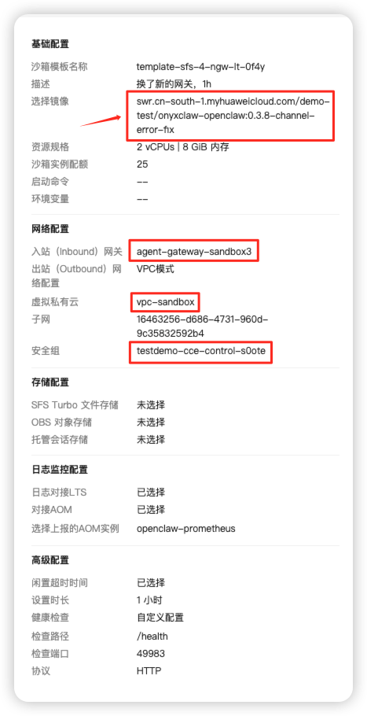

# 云资源前置条件：华为云空账号到可部署状态

本手册定义一键部署之前由用户在华为云控制台完成的部分。它适合新账号或没有现成网络、CCE、
AgentSphere 资源的环境；完成后转到 [人工部署与使用](./HUMAN_DEPLOYMENT.md)。

目标是让 CCE APP、AgentSphere Gateway/Template/Sandbox 与 SFS Turbo 位于同一 VPC，并让 Sandbox
通过 SNAT 访问公网模型服务。当前交付包固定支持 Region `cn-south-1`（华南-广州）。

## 创建顺序

```text
账号/权限 → VPC与子网 → CCE集群与节点 → kubeconfig
→ NAT Gateway与SNAT → SFS Turbo → AgentSphere网关
→ 在Template中选择公开OpenClaw镜像 → 填写本地配置 → 部署
```

| 阶段 | 需要记录的输出 | 是否由脚本完成 |
| --- | --- | --- |
| VPC/子网 | VPC、子网 ID 与 CIDR | 控制台手工，或从零 Terraform 创建 |
| CCE | kubeconfig 绝对路径、current context、节点状态 | Terraform 可创建集群/节点/EIP；kubeconfig 下载和 `config/` 填写仍人工 |
| NAT/SNAT | Sandbox 所在子网具备公网 HTTPS 出网 | Terraform |
| SFS Turbo | 文件系统 ID、NFS 共享根路径 | Terraform ；目录准备由脚本完成 |
| AgentSphere 网关 | 私网数据面 URL | 否 |
| AgentSphere Template | Template ID | 否 |
| Kubernetes APP | namespace、Service、Channel ELB、Deployment | 是 |

## 选择基础设施路径

以下两条路径只可二选一；它们最终都进入本包唯一的 `config/` 与 `scripts/` APP 部署流程，不能混用同一套
资源或维护第二份 APP 配置。

| 路径 | 负责范围 | 后续仍需人工完成 |
| --- | --- | --- |
| 控制台手工 | 按本手册第 1–4 节创建 VPC、CCE、NAT/SNAT、SFS | kubeconfig 下载、AgentSphere 网关/Template、填写 `config/` |
| Terraform IaC | 从零创建独立 VPC/子网、CCE/节点/EIP、NAT/SNAT、SFS | kubeconfig 下载、AgentSphere 网关/Template、填写 `config/` |

Terraform **不**创建 Kubernetes APP、AgentSphere 网关或 Template，也不会读取、生成或覆盖
`config/config.env`、`config/secrets.env`。

## Terraform IaC：从零创建基础设施（可选）

在新的 Demo/Test 环境中，可先执行：

```bash
cd iac/cce
cp terraform.tfvars.example terraform.tfvars
cp secrets.auto.tfvars.example secrets.auto.tfvars
chmod 600 secrets.auto.tfvars
# 编辑写入ak/sk，节点密码，以及资源配置（默认）

terraform init
terraform fmt -check
terraform validate
terraform plan -out=cce.plan
# 人工核对 plan，确认只创建本次独立测试资源后：
terraform apply cce.plan
terraform output
```

`terraform.tfvars` 中至少按目标 Region/AZ 核对 CCE 版本、节点规格、节点登录方式、镜像/磁盘类型和 CIDR。
若要以节点公网 EIP 的 `NodePort 30080` 访问 APP，保持 `enable_worker_node_eip = true`，并在申请前确认账户
EIP 配额至少能覆盖：**API Server EIP、SNAT EIP、节点 EIP** 三项。节点 EIP 仅用于 SSH/NodePort 入站，不能代替
Sandbox 的 SNAT EIP。

为避免 SFS Turbo 名称冲突，给 `sfs_name` 设置一个本次测试唯一的名称。若首次 apply 只部分成功（例如 CCE 集群
已创建但节点因 EIP 配额失败），不要复用旧 plan：先修复配置或配额，再重新执行 `terraform plan -out=cce-retry.plan`，
核对只补建缺失资源后执行 `terraform apply cce-retry.plan`。

apply 成功后记录并映射这些输出，如下图表所示：



| Terraform output | 后续用途 |
| --- | --- |
| `vpc_id`、`subnet_id` | 创建 AgentSphere 私网网关及 Template 的 VPC 模式网络选择。 |
| `api_server_eip_address` | 从 CCE 控制台下载公网 kubeconfig 后，在部署机使用 `kubectl` 连接。 |
| `worker_node_public_ip` | 可选 NodePort 浏览器入口：`http://<node-eip>:30080`。 |
| `sfs_turbo_id`、`sfs_nfs_export_location` | 填写 `SFS_TURBO_ID`，并传给 `scripts/prepare-sfs.sh --nfs-endpoint`。 |
| `snat_eip_address`、`nat_gateway_id` | 验证 Sandbox 的模型公网出网已具备独立 SNAT 路径。 |

随后从本手册第 5 节继续创建 AgentSphere 网关；完成 Template 后进入第 8 节，运行 `scripts/init.sh` 并填写唯一
的 `config/`。IaC 详细参数说明见 [`iac/cce/README.md`](../iac/cce/README.md)。

## 0. 账号、部署机和密钥

用户需要具备创建或使用 VPC、CCE、EIP、NAT Gateway、SFS Turbo、ELB、AgentSphere 的权限，
并承担按需资源费用。部署机需安装 Node.js `22.19+` 与 `kubectl`。

另行申请以下密钥，稍后只填写到本地 `config/secrets.env`：

- AgentSphere E2B API Key；
- DeepSeek API Key（或所选模型 Provider 的等价密钥）。

不要把云账号密码、节点登录密码、SSH 私钥、kubeconfig 或 API Key 写入本包任何可提交文件。

## 1. 创建 VPC 和子网

创建一个 VPC 和至少一个子网，供 CCE 节点、AgentSphere 智能体网关、Template/Sandbox 和 SFS Turbo 使用。
VPC CIDR 不得与 CCE 容器网段、Service 网段或部署机所在网络冲突。例如 VPC `192.168.0.0/16`，子网 `192.168.0.0/24`；最终以账号既有网络规划为准。

记录 VPC/子网的名称、ID、CIDR、安全组。默认 DNS 可以保持华为云配置，无需为本演示单独搭建 DNS。
参考：[创建 VPC 和子网](https://support.huaweicloud.com/usermanual-vpc/zh-cn_topic_0013935842.html)。

## 2. 创建 CCE 集群、节点并导出 kubeconfig

本节是**控制台手工路径**。若已选择上文的 Terraform IaC 路径，请跳至第 5 节；两个路径最终都需要下述
kubeconfig 下载和验证步骤。

1. 在同一 Region/VPC 创建 CCE 集群，容器网段、Service 网段均不得与 VPC 网段重叠；
2. 为 API Server 绑定 EIP，供部署机远程运行 `kubectl`；
3. 绑定后重新下载公网 kubeconfig；
4. 添加至少一个工作节点，等待其为 `Ready`；
5. 在部署机验证 kubeconfig、context 与节点状态。

注意：集群 API Server EIP、节点 SSH EIP、NAT/SNAT EIP 是三种不同用途的公网入口，不能混用。节点 EIP 仅在
需要 SSH 或访问 APP NodePort 时配置；不用 SSH 时无需为部署脚本准备节点密码或密钥。Demo/Test 可使用
2 vCPU/8 GiB、Ubuntu 22.04、containerd、50 GiB 系统盘和 100 GiB 数据盘的按需节点作为起点；生产应按
可用性和容量设计节点规模。

下载 kubeconfig 后收紧权限并确认：

```bash
chmod 600 /absolute/path/to/cce-kubeconfig.yaml
kubectl --kubeconfig /absolute/path/to/cce-kubeconfig.yaml config get-contexts
kubectl --kubeconfig /absolute/path/to/cce-kubeconfig.yaml get nodes -o wide
```

若一个 kubeconfig 中保存了多个集群，再在上述命令和 `config/config.env` 中额外指定目标 `KUBE_CONTEXT`。

参考：[创建 CCE 集群](https://support.huaweicloud.com/intl/zh-cn/usermanual-cce/cce_10_0028.html)、
[创建节点](https://support.huaweicloud.com/usermanual-cce/cce_10_0363.html)、
[获取 kubeconfig](https://support.huaweicloud.com/usermanual-cce/cce_10_0107.html)、
[配置 API Server 公网访问](https://support.huaweicloud.com/usermanual-cce/cce_10_0864.html)。

## 3. 配置 Sandbox 的公网模型出网

创建公网 NAT Gateway，并在 **AgentSphere Sandbox 实际使用的子网** 上添加 SNAT 规则，绑定独立 EIP。完整
Terraform 示例 `terraform.tfvars.example` 已设置 `manage_snat = true`，会按新建子网创建三项资源；除非明确
不需要 Sandbox 访问公网模型，否则保持该值不变。
这条规则用于 Sandbox 中的 OpenClaw 请求 `https://api.deepseek.com` 等公网模型 Endpoint；至少应允许
DNS 与 HTTPS `443/TCP` 出网。

NAT Gateway 创建后仍需添加 SNAT 规则；只购买 NAT 或只创建 EIP 不足以让 Sandbox 出网。不要将节点入站
EIP 当作 SNAT EIP。实际的 NAT 规格、带宽与计费按账号的测试/生产容量决定。

参考：[购买公网 NAT Gateway](https://support.huaweicloud.com/usermanual-natgateway/zh-cn_topic_0150270259.html)、
[添加 SNAT 规则](https://support.huaweicloud.com/usermanual-natgateway/zh-cn_topic_0127489529.html)。

## 4. 创建 SFS Turbo 并准备 workspace

创建与 CCE/AgentSphere 同 VPC 的 SFS Turbo。Demo/Test 可选择 NFS 协议、与节点相同可用区的性能型实例；若使用
Terraform，已设置 `manage_sfs = true`，它会创建 SFS Turbo 及专用安全组。容量和安全组由实际业务决定。记录：

- SFS Turbo 文件系统 ID，填写到 `SFS_TURBO_ID`；
- 控制台给出的 NFS 共享根路径（形如 `192.168.x.x:/`）。

SFS 创建后，使用 `scripts/prepare-sfs.sh` 初始化 `/onyxclaw/workspace` 并验证 UID/GID `1000` 写权限。
命令见 [人工部署与使用](./HUMAN_DEPLOYMENT.md#2-准备并验证-sfs-turbo)。

参考：[创建 SFS Turbo 文件系统](https://support.huaweicloud.com/usermanual-sfsturbo/sfsturbo_01_0359.html)。

## 5. 创建智能体网关

在 AgentSphere 创建智能体网关，或使用账号内系统默认网关。必须同时满足：

- 状态为可用；
- **开启私网访问**；
- 关联本次 VPC 和子网；
- 后续 Template 与 Sandbox 使用相同 VPC/子网。

记录网关的**私网数据面地址**，例如 `https://<gateway-host>`，填写到
`AGENTSPHERE_SANDBOX_URL`。

以“VPC 关联状态可用 + 私网访问开启”为继续条件。

参考：[创建智能体网关](https://support.huaweicloud.com/usermanual-agentsphere/agentsphere_03_0024.html)。

## 6. 在 Template 中选择稳定 OpenClaw 镜像

当前稳定 OpenClaw 源镜像是公开镜像：

```text
swr.cn-south-1.myhuaweicloud.com/demo-test/onyxclaw-openclaw:0.3.8-channel-error-fix
```

在 AgentSphere 的“创建沙箱模板”页面，将这条完整 tag 直接粘贴到**选择镜像**输入框即可。它是公开镜像；
不需要在目标租户创建 SWR 组织/仓库，也不需要拉取、重新推送或填写目标租户的 `image@sha256` 地址。
该镜像不是 `config/config.env` 的用户输入，部署器会固定记录此版本，避免配置与实际 Template 镜像漂移。

## 7. 在 AgentSphere 创建 Template

创建 Template 前先有可用的私网网关。控制台中的关键选择为：

- 在“选择镜像”直接填入步骤 6 的公开 OpenClaw 镜像；
- 关联已开启私网访问的智能体网关；
- 选择与网关、SFS、CCE 相同的 VPC/子网；
- 健康检查使用 HTTP `/health`，端口 `49983`；
- 启用空闲超时，可用 5分钟 作为 Demo/Test 起点；
- 不在 Template 页面再次静态挂载 SFS Turbo。APP 创建 Sandbox 时会通过运行时元数据注入 SFS 挂载。

gateway与template示例：




提交后记录 Template ID。控制台详细步骤见
[创建 AgentSphere Template](https://support.huaweicloud.com/usermanual-agentsphere/agentsphere_03_0006.html)。

## 8. 进入部署阶段

至此应已具备：kubeconfig（及其 current context）、SFS ID/NFS 根路径、网关私网 URL、Template ID、
AgentSphere/模型 API Key，以及 Sandbox 子网 SNAT 出网。回到 [人工部署与使用](./HUMAN_DEPLOYMENT.md)
初始化 `config/` 并开始部署。

Channel 私网 ELB 不在本阶段预建。默认配置会由 CCE 在部署时自动创建共享型私网 ELB，并托管
`18890/TCP` 监听器和后端；本交付包的固定首次部署方案不复用已有 ELB。相关机制见
[CCE LoadBalancer Service annotations](https://support.huaweicloud.com/usermanual-cce/cce_10_0385.html)。

## 费用与清理

测试结束后，在 APP 内 reset 明确的 Sandbox，再逐项检查 CCE 节点、API Server/节点/NAT EIP、
NAT Gateway、SFS Turbo 和自动创建 ELB。确认明确资源 ID 和依赖关系后，再单独决定保留或释放；
不要批量删除账号资源。
