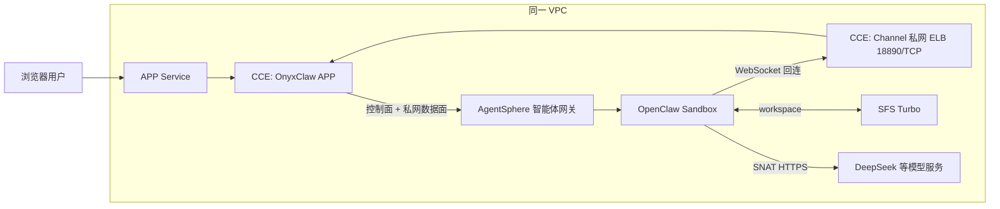

# 人工部署与使用：OnyxClaw on CCE + AgentSphere

本手册从“华为云资源、智能体网关和 Template 已准备好”开始。若尚未准备，请先完成
[云资源前置条件](./CLOUD_PREREQUISITES.md)。部署入口、文件职责与 Agent 路径见项目根目录
[`README.md`](../README.md)。

## 架构与责任边界



脚本只创建 CCE 内的 Namespace、Service、ConfigMap、Secret 和 Deployment。默认由 CCE 的
LoadBalancer Service 自动创建 **Channel 私网 ELB**，并托管 `18890/TCP` 监听器及后端；因此不要提前在
ELB 控制台手工创建这个监听器或把“onyxclaw app”作为固定后端。智能体网关和 Template 仍须在
AgentSphere 控制台人工完成。

## 1. 初始化本地配置

在交付包根目录运行：

```bash
./scripts/init.sh
```

它会从 `config/*.example` 创建以下三个文件，若已存在则保留原文件，并将新文件权限收紧为 `600`：

| 文件 | 填什么 | 是否敏感 |
| --- | --- | --- |
| `config/config.env` | 目标集群、AgentSphere 与 SFS 的四项环境信息 | 有环境信息，不提交 |
| `config/secrets.env` | AgentSphere E2B API Key、模型 API Key | 是，不提交、不分享 |
| `config/openclaw-base-config.json` | 随包生成的固定 DeepSeek/OpenClaw 基础配置 | 运行时会注入密钥；首次部署不需要编辑 |

### `config/config.env` 必填项

| 分组 | 字段 | 说明 |
| --- | --- | --- |
| CCE | `KUBECONFIG` | 从 CCE 控制台导出的 kubeconfig **绝对路径**。 |
| AgentSphere | `AGENTSPHERE_SANDBOX_URL` | 已开启私网访问的智能体网关私网数据面 URL。 |
| AgentSphere | `AGENTSPHERE_TEMPLATE_ID` | 控制台创建后的 Template ID。Template 的“选择镜像”直接使用固定公开 OpenClaw tag，不需要在此文件填写镜像地址。 |
| SFS | `SFS_TURBO_ID` | 同一 VPC 中 SFS Turbo 的文件系统 ID。 |

`config/secrets.env` 只需要用户填写 `AGENTSPHERE_E2B_API_KEY` 和 `MODEL_API_KEY`。不需要填写 Channel
签名密钥或 Gateway token；部署器会使用内部占位符，稳定 APP 会在运行时初始化 Gateway token。

为保证部署结果可复现，部署器固定使用华南-广州、`onyxclaw` namespace、已验证的 APP digest、DeepSeek
`deepseek-v4-flash`、NodePort `30080`、以及由 CCE 自动创建的私网 Channel ELB（`18890/TCP`）。SFS
workspace 固定为 `/onyxclaw/workspace`。这些不是首次部署的填写项。

如果同一个 kubeconfig 保存多个集群，可额外填写可选 `KUBE_CONTEXT`；否则部署器使用该 kubeconfig 的
`current-context`。需要隔离多个演示时也可选填 `NAMESPACE`，默认值为 `onyxclaw`。

## 2. 准备并验证 SFS Turbo

在 SFS Turbo 已创建、获得控制台显示的 NFS 共享根路径后运行：

```bash
./scripts/prepare-sfs.sh \
  --kubeconfig /absolute/path/to/cce-kubeconfig.yaml \
  --nfs-endpoint <sfs-console-shared-path> \
  --share-path /onyxclaw/workspace
```

成功标准是输出 `directory-owner=1000:1000` 与 `SFS_PREPARE_OK`。该脚本只使用明确名称的临时 Pod；
成功后删除该 Pod，失败时保留它供诊断。

## 3. 校验并部署

按顺序执行：

```bash
# 离线检查输入、固定 digest、URL、SFS、ELB 配置；不会连接集群
node scripts/deploy.mjs --config config/config.env --secrets config/secrets.env --dry-run

# 只读检查目标 kubeconfig/current-context、RBAC 和同名资源归属
./scripts/deploy.sh --check-cluster

# 首次 namespace 不存在时只创建 namespace；其余资源走 API Server dry-run
./scripts/deploy.sh --server-dry-run

# 创建/更新 APP、Service、ConfigMap、Secret 和 Deployment
./scripts/deploy.sh
```

正式部署会等待 Channel ELB 地址、Deployment rollout，并从 APP Pod 解析 AgentSphere 控制面和私网数据面
域名，再检查 `/api/ui-config` 中的 Provider、Region、Template 和模型。出现 `DNS_ERROR` 时先检查网关
私网访问、VPC/子网及 DNS，不能继续创建 Sandbox。

APP 默认以 NodePort `30080` 提供页面。Demo 可通过已授权来源的节点公网 EIP 访问，也可使用
`kubectl port-forward`；不要为了方便把整个安全组开放到公网。

## 4. 使用与端到端验收

部署完成后，在浏览器打开 APP，按以下流程测试：

1. 点击 **“进入龙虾模式”**。APP 使用配置中的 Template ID 在 AgentSphere 创建 OpenClaw Sandbox；
2. 确认或编辑 `SOUL.md`，等待 Gateway 和 Channel 回连；
3. 发送一条测试消息，确认 DeepSeek 等模型有回复；
4. 点击“暂停”，再点击“恢复”。恢复后应仍是同一个 Sandbox ID，SOUL 内容仍存在，并能继续对话；
5. 点击“重置新用户”，APP 会 kill 当前 Sandbox 并回到 idle；到 AgentSphere 控制台按 Sandbox ID 确认
   已删除/终止。

只有页面能打开，不能算完整验收。至少应证明：Sandbox 创建成功、`openclaw.json` 与 `SOUL.md` 写入成功、
Gateway ready、Channel 已连接、模型对话成功、pause/resume 成功，且 reset 后 APP 状态为
`mode=idle`、`sandboxId=null`、`error=null`。恢复阶段首次 readiness 短暂失败可重试，但最终必须恢复成功。

点击重置后再次点击“进入龙虾模式”会创建**新的** Sandbox；测试和费用检查时应按 ID 分别确认清理。

## 5. 日常排查与参考

- 镜像、Service/ELB、SFS、网络及生命周期预期： [稳定基线](./references/CURRENT_DEMO_BASELINE.md)。
- 空账号实际走通时的配置选择、遇到的端点错误及完整验收结果：
  [空账号自测记录](./references/NEW_ACCOUNT_VALIDATION.md)。
- 自动化 Agent 的预检、证据与停止条件： [Agent 部署 Runbook](./AGENT_DEPLOYMENT.md)。

测试结束后，先在 APP 内重置明确的 Sandbox，再逐项决定是否保留 CCE 节点、NAT Gateway、EIP、SFS Turbo
和自动创建 ELB。每个计费资源都要按其明确 ID 单独确认后处理。
